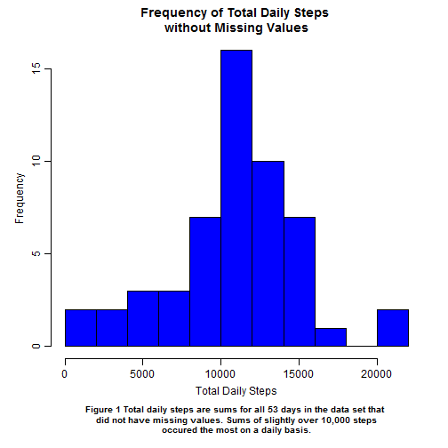
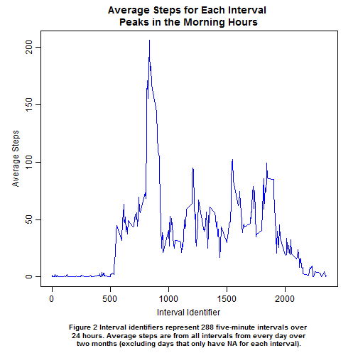
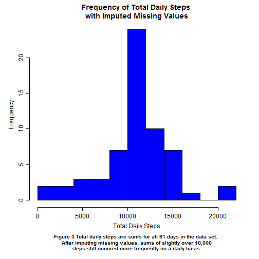
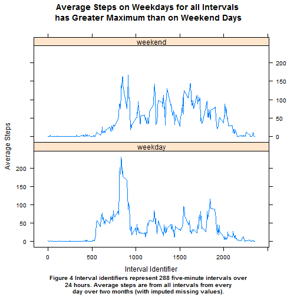

# Reproducible Research: Peer Assessment 1

### Loading and Preprocessing the Data

Download and unzip the dataset:


```r
if(!file.exists("activity.csv")) {
temp <- tempfile()
fileUrl <- "https://d396qusza40orc.cloudfront.net/repdata%2Fdata%2Factivity.zip"
download.file(fileUrl, destfile = temp)
unzip(temp)
unlink(temp)
}
```
Read the data into R:

```r
act <- read.csv("activity.csv", stringsAsFactors = FALSE)
```
Change the date column to the date class:

```r
act$date <- as.Date(act$date, "%Y-%m-%d")
```
### What is the Mean Number of Steps Taken Per Day?
Find the sum of steps for each date (excluding dates that are all "NA"):

```r
sum.steps <- aggregate(steps ~ date, data = act, sum, na.rm = TRUE)
head(sum.steps)
```

```
##         date steps
## 1 2012-10-02   126
## 2 2012-10-03 11352
## 3 2012-10-04 12116
## 4 2012-10-05 13294
## 5 2012-10-06 15420
## 6 2012-10-07 11015
```
Plot a histogram of the sums:

```r
par(mgp = c(2, 0.7, 0))
par(mar = c(7, 4, 3, 2))
hist(sum.steps$steps,
     breaks = 15,
     xlab = "Total Daily Steps",
     main = "Frequency of Total Daily Steps \nwithout Missing Values",
     col = "blue")
mtext("Figure 1 Total daily steps are sums for all 53 days in the data set that 
did not have missing values. Sums of slightly over 10,000 steps
occured the most on a daily basis.", 
      side = 1, font = 2, line = 5, cex = 0.8)
```


  
Find the average total steps (excluding dates that are all "NA"):

```r
mean(sum.steps$steps)
```

```
## [1] 10766.19
```
Find the median total steps (excluding dates that are all "NA"):

```r
median(sum.steps$steps)
```

```
## [1] 10765
```
  
### What is the Average Daily Activity Pattern
Find the average steps for each interval (averaged over all dates):

```r
int.mean.steps <- aggregate(steps ~ interval, data = act, mean, na.rm = TRUE)
head(int.mean.steps)
```

```
##   interval     steps
## 1        0 1.7169811
## 2        5 0.3396226
## 3       10 0.1320755
## 4       15 0.1509434
## 5       20 0.0754717
## 6       25 2.0943396
```
Create a time series plot of int.mean.steps:

```r
par(mgp = c(2, 0.7, 0))
par(mar = c(7,4,3,2))
plot(int.mean.steps$interval, int.mean.steps$steps, 
     type = "l",
     xlab = "Interval Identifier",
     ylab = "Average Steps",
     main = "Average Steps for Each Interval \nPeaks in the Morning Hours",
     col = "blue")
mtext("Figure 2 Interval identifiers represent 288 five-minute intervals over 
24 hours. Average steps are from all intervals from every day over
two months (excluding days that only have NA for each interval).", 
      side = 1, font = 2, line = 5, cex = 0.8)
```


  
Find the interval with the max average (again, it is the average over all dates from above):

```r
int.mean.steps[which.max(int.mean.steps$steps), "interval"]
```

```
## [1] 835
```
### Imputing Missing Values
Calculate total number of missing values:

```r
sum(is.na(act$steps))
```

```
## [1] 2304
```
Get dates that have NA values and change their missing values to the averages for each interval (from int.mean.steps above):

```r
na.dates <- unique(act[which(is.na(act$steps) == TRUE), "date"])
act.filled <- act
for(i in 1:length(na.dates)) {
        act.filled[which(act$date == na.dates[i]), "steps"] <- int.mean.steps$steps
}
```
Find the sum of steps for each date in new dataset (act.filled) with imputed missing values:

```r
sum.steps.filled <- aggregate(steps ~ date, data = act.filled, sum, na.rm = TRUE)
head(sum.steps.filled)
```

```
##         date    steps
## 1 2012-10-01 10766.19
## 2 2012-10-02   126.00
## 3 2012-10-03 11352.00
## 4 2012-10-04 12116.00
## 5 2012-10-05 13294.00
## 6 2012-10-06 15420.00
```
Plot a histogram of the sums:

```r
par(mgp = c(2, 0.7, 0))
par(mar = c(7, 4, 3, 2))
hist(sum.steps.filled$steps, 
     breaks = 15,
     xlab = "Total Daily Steps",
     main = "Frequency of Total Daily Steps \nwith Imputed Missing Values",
     col = "blue")

mtext("Figure 3 Total daily steps are sums for all 61 days in the data set. 
After imputing missing values, sums of slightly over 10,000
steps still occured more frequently on a daily basis.", 
      side = 1, font = 2, line = 5, cex = 0.8)
```


  
Find the average total steps from new dataset (act.filled) with imputed missing values:

```r
mean(sum.steps.filled$steps)
```

```
## [1] 10766.19
```
Find the median total steps from new dataset (act.filled) with imputed missing values:

```r
median(sum.steps.filled$steps)
```

```
## [1] 10766.19
```
When comparing the histograms in figure 1 and figure 3, it is clear that imputing missing values made the frequency of 10,000+ steps greater. This is because the sum of steps for int.mean.steps is 10,766.19 (as seen in the calculation below). The mean steps remained the same at 10,766.19 and the median rose to the same value.   


```r
sum(int.mean.steps$steps)
```

```
## [1] 10766.19
```

### Are there differences in activity patterns between weekdays and weekends? (using dataset with imputed missing values)
Create factor variable in dataset with two levels: "weekday" and "weekend":

```r
act.filled$day <- ifelse(test = weekdays(act.filled$date) %in% c("Saturday", "Sunday"), 
                         yes = "weekend", 
                         no = "weekday")
act.filled$day <- as.factor(act.filled$day)
```
Create data frame that has average steps for each interval for weekdays and weekends:

```r
int.mean.steps2 <- aggregate(steps ~ interval + day, data = act.filled, mean, na.rm = TRUE)
```
Make panel plot:

```r
library(lattice)
xyplot(steps~interval|day, 
       data = int.mean.steps2, 
       type = "l",
       main = "Average Steps on Weekdays for all Intervals \nhas Greater Maximum than on Weekend Days",
       xlab = "Interval Identifier",
       ylab = "Average Steps",
       layout = c(1, 2),
       sub = list("Figure 4 Interval identifiers represent 288 five-minute intervals over
24 hours. Average steps are from all intervals from every
day over two months (with imputed missing values).", 
                  cex = 0.8))
```


  
On average, there seems to be more consistent activity throughout all the intervals on weekend days than there is on weekdays.
